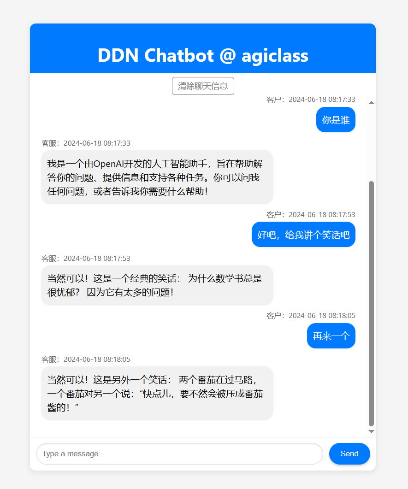

# DDN Chatbot @ agiclass

This project is a chatbot interface developed using Flask and JavaScript. The chatbot uses OpenAI's GPT-4 model to interact with users.



## Features

- Chat interface with a modern design
- Messages are stored in an SQLite database
- Option to clear chat history with a confirmation prompt
- Responsive design

## Requirements

- Python 3.x
- Flask
- OpenAI API

## Installation

1. Clone the repository:
    ```sh
    git clone https://github.com/yourusername/ddn-chatbot.git
    cd ddn-chatbot
    ```

2. Create a virtual environment and activate it:
    ```sh
    python -m venv venv
    source venv/bin/activate   # On Windows, use `venv\Scripts\activate`
    ```

3. Install the dependencies:
    ```sh
    pip install -r requirements.txt
    ```

4. Set up the environment variables:
    - Create a `.env` file and record the path in System variable "ENV_PATH"
    - Add your OpenAI API key to the `.env` file:
      ```
      OPENAI_API_KEY="XXXXXXXXXXXXXXXXXXXXXXXXXXXXXXXXXXXX"
      OPENAI_BASE_URL="XXXXXXXXXXXXXXXXXXXXXXX"
      ```

5. Set up the SQLite database:
    ```sh
    python backend/setup_db.py
    ```

## Running the Application

1. Start the Flask server:
    ```sh
    python backend/flask_client.py
    ```

2. Open your browser and go to `http://127.0.0.1:5000` to access the chat interface.

## Project Structure

